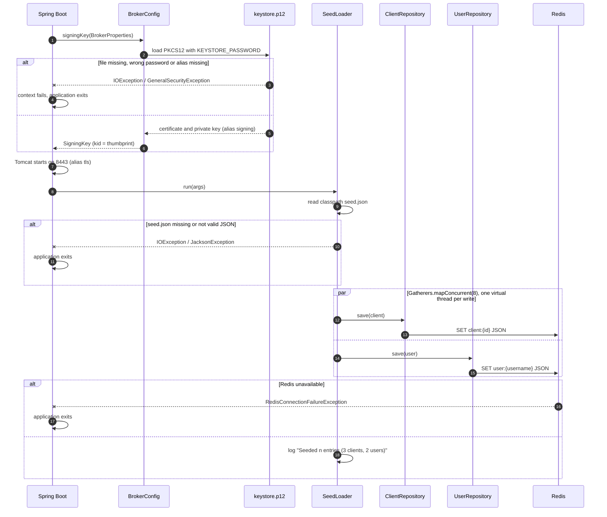

# Startup

The signing key is loaded from `keystore.p12` while the context starts; `seed.json` is written to Redis once the server is up. A failure in either stops the application.

```mermaid
sequenceDiagram
    autonumber
    participant SB as Spring Boot
    participant BC as BrokerConfig
    participant KS as keystore.p12
    participant SL as SeedLoader
    participant CR as ClientRepository
    participant UR as UserRepository
    participant R as Redis

    SB->>BC: signingKey(BrokerProperties)
    BC->>KS: load PKCS12 with KEYSTORE_PASSWORD
    alt file missing, wrong password or alias missing
        KS--xSB: IOException / GeneralSecurityException
        SB->>SB: context fails, application exits
    else
        KS-->>BC: certificate and private key (alias signing)
        BC-->>SB: SigningKey (kid = thumbprint)
    end
    SB->>SB: Tomcat starts on 8443 (alias tls)

    SB->>SL: run(args)
    SL->>SL: read classpath seed.json
    alt seed.json missing or not valid JSON
        SL--xSB: IOException / JacksonException
        SB->>SB: application exits
    end
    par Gatherers.mapConcurrent(8), one virtual thread per write
        SL->>CR: save(client)
        CR->>R: SET client:{id} JSON
    and
        SL->>UR: save(user)
        UR->>R: SET user:{username} JSON
    end
    alt Redis unavailable
        R--xSB: RedisConnectionFailureException
        SB->>SB: application exits
    else
        SL->>SL: log "Seeded n entries (3 clients, 2 users)"
    end
```
