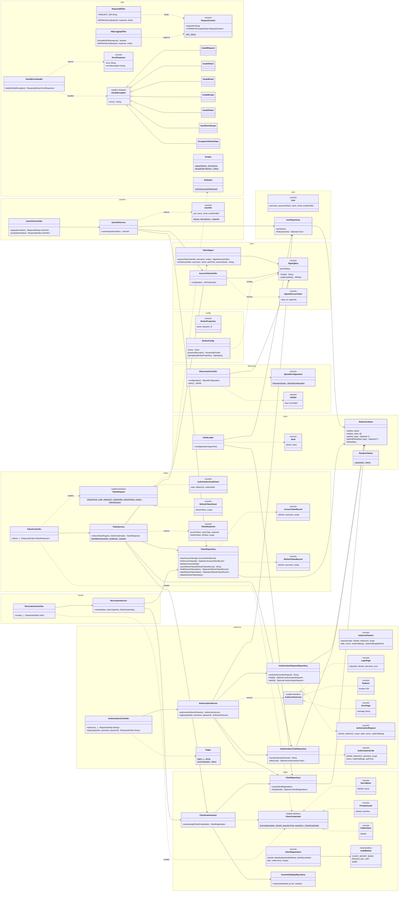

# Class diagram

Main types by package. Records are marked `<<record>>`, sealed hierarchies `<<sealed>>`. Spring annotations, OpenAPI annotations and private helpers are left out.

```mermaid
classDiagram
    direction LR

    namespace web {
        class RequestIdFilter {
            +REQUEST_ID$ String
            #doFilterInternal(request, response, chain)
        }
        class HttpLoggingFilter {
            #shouldNotFilter(request) boolean
            #doFilterInternal(request, response, chain)
        }
        class RequestContext {
            <<record>>
            +requestId String
            +CURRENT$ ScopedValue~RequestContext~
            +id()$ String
        }
        class OAuthErrorHandler {
            handle(OAuthException) ResponseEntity~ErrorResponse~
        }
        class ErrorResponse {
            <<record>>
            +error String
            +errorDescription String
        }
        class OAuthException {
            <<sealed, abstract>>
            +error() String
        }
        class InvalidRequest
        class InvalidClient
        class InvalidGrant
        class InvalidScope
        class InvalidToken
        class InsufficientScope
        class UnsupportedGrantType
        class Scopes {
            +parse(String)$ Set~String~
            +format(Set~String~)$ String
        }
        class Subtasks {
            +join(StructuredTaskScope)$
        }
    }

    namespace authorize {
        class AuthorizationController {
            +authorize(...) ResponseEntity~String~
            +login(requestId, username, password) ResponseEntity~String~
        }
        class AuthorizationService {
            +authorize(AuthorizeParams) AuthorizeOutcome
            +login(requestId, username, password) AuthorizeOutcome
        }
        class AuthorizeParams {
            <<record>>
            responseType, clientId, redirectUri, scope
            state, nonce, codeChallenge, codeChallengeMethod
        }
        class AuthorizeOutcome {
            <<sealed interface>>
        }
        class LoginPage {
            <<record>>
            requestId, clientId, username, error
        }
        class Redirect {
            <<record>>
            location URI
        }
        class ErrorPage {
            <<record>>
            message String
        }
        class AuthorizationRequest {
            <<record>>
            clientId, redirectUri, scope, state, nonce, codeChallenge
        }
        class AuthorizationCode {
            <<record>>
            clientId, redirectUri, username, scope
            nonce, codeChallenge, authTime
        }
        class AuthorizationRequestRepository {
            +save(AuthorizationRequest) String
            +find(id) Optional~AuthorizationRequest~
            +take(id) Optional~AuthorizationRequest~
        }
        class AuthorizationCodeRepository {
            +save(AuthorizationCode) String
            +take(code) Optional~AuthorizationCode~
        }
        class Pages {
            login(...)$ String
            error(message)$ String
        }
    }

    namespace client {
        class ClientAuthenticator {
            +authenticate(ClientCredentials) ClientRegistration
        }
        class ClientCredentials {
            <<sealed interface>>
            from(authorization, clientId, assertionType, assertion)$ ClientCredentials
        }
        class SecretBasic {
            <<record>>
            clientId, secret
        }
        class PrivateKeyJwt {
            <<record>>
            clientId, assertion
        }
        class PublicClient {
            <<record>>
            clientId
        }
        class ClientRegistration {
            <<record>>
            clientId, tokenEndpointAuthMethod, clientSecretHash
            jwks, redirectUris, scopes
        }
        class AuthMethod {
            <<enumeration>>
            CLIENT_SECRET_BASIC
            PRIVATE_KEY_JWT
            NONE
        }
        class ClientRepository {
            +save(ClientRegistration)
            +find(clientId) Optional~ClientRegistration~
        }
        class AssertionReplayRepository {
            +markUsed(clientId, jti, ttl) boolean
        }
    }

    namespace token {
        class TokenController {
            +token(...) ResponseEntity~TokenResponse~
        }
        class TokenService {
            +token(TokenRequest, ClientCredentials) TokenResponse
            pkceMatches(verifier, challenge)$ boolean
        }
        class TokenRequest {
            <<sealed interface>>
            of(grantType, code, redirectUri, codeVerifier, refreshToken, scope)$ TokenRequest
        }
        class AuthorizationCodeGrant {
            <<record>>
            code, redirectUri, codeVerifier
        }
        class RefreshTokenGrant {
            <<record>>
            refreshToken, scope
        }
        class TokenResponse {
            <<record>>
            accessToken, tokenType, expiresIn
            refreshToken, idToken, scope
        }
        class TokenRepository {
            +saveAccessToken(jti, AccessTokenRecord)
            +findAccessToken(jti) Optional~AccessTokenRecord~
            +deleteAccessToken(jti)
            +saveRefreshToken(RefreshTokenRecord) String
            +findRefreshToken(token) Optional~RefreshTokenRecord~
            +takeRefreshToken(token) Optional~RefreshTokenRecord~
            +deleteRefreshToken(token)
        }
        class AccessTokenRecord {
            <<record>>
            clientId, username, scope
        }
        class RefreshTokenRecord {
            <<record>>
            clientId, username, scope
        }
    }

    namespace revoke {
        class RevocationController {
            +revoke(...) ResponseEntity~Void~
        }
        class RevocationService {
            +revoke(token, tokenTypeHint, ClientCredentials)
        }
    }

    namespace userinfo {
        class UserInfoController {
            +get(authorization) ResponseEntity~UserInfo~
            +post(authorization) ResponseEntity~UserInfo~
        }
        class UserInfoService {
            +userInfo(authorization) UserInfo
        }
        class UserInfo {
            <<record>>
            sub, name, email, emailVerified
            of(User, Set~String~)$ UserInfo
        }
    }

    namespace jose {
        class TokenSigner {
            +accessToken(clientId, username, scope) SignedAccessToken
            +idToken(clientId, username, nonce, authTime, accessToken) String
        }
        class AccessTokenVerifier {
            +verify(token) JWTClaimsSet
        }
        class SigningKey {
            <<record>>
            jwk RSAKey
            +keyId() String
            +publicJwkSet() JWKSet
        }
        class SignedAccessToken {
            <<record>>
            value, jti, expiresAt
        }
    }

    namespace discovery {
        class DiscoveryController {
            +configuration() OpenIdConfiguration
            +jwks() JwkSet
        }
        class OpenIdConfiguration {
            <<record>>
            forIssuer(issuer)$ OpenIdConfiguration
        }
        class JwkSet {
            <<record>>
            keys List~Map~
        }
    }

    namespace user {
        class User {
            <<record>>
            username, passwordHash, name, email, emailVerified
        }
        class UserRepository {
            +save(User)
            +find(username) Optional~User~
        }
    }

    namespace store {
        class RedisJsonStore {
            +set(key, value)
            +set(key, value, ttl)
            +get(key, type) Optional~T~
            +getAndDelete(key, type) Optional~T~
            +delete(key)
        }
        class SeedLoader {
            +run(ApplicationArguments)
        }
        class Seed {
            <<record>>
            clients, users
        }
        class RandomTokens {
            +generate()$ String
        }
    }

    namespace config {
        class BrokerProperties {
            <<record>>
            issuer, keystore, ttl
        }
        class BrokerConfig {
            clock() Clock
            passwordEncoder() PasswordEncoder
            signingKey(BrokerProperties) SigningKey
        }
    }

    %% Sealed hierarchies
    OAuthException <|-- InvalidRequest
    OAuthException <|-- InvalidClient
    OAuthException <|-- InvalidGrant
    OAuthException <|-- InvalidScope
    OAuthException <|-- InvalidToken
    OAuthException <|-- InsufficientScope
    OAuthException <|-- UnsupportedGrantType
    AuthorizeOutcome <|.. LoginPage
    AuthorizeOutcome <|.. Redirect
    AuthorizeOutcome <|.. ErrorPage
    ClientCredentials <|.. SecretBasic
    ClientCredentials <|.. PrivateKeyJwt
    ClientCredentials <|.. PublicClient
    TokenRequest <|.. AuthorizationCodeGrant
    TokenRequest <|.. RefreshTokenGrant

    %% Request pipeline
    RequestIdFilter ..> RequestContext : binds
    HttpLoggingFilter ..> RequestContext : reads id
    OAuthErrorHandler ..> OAuthException : handles
    OAuthErrorHandler ..> ErrorResponse : returns

    %% Authorization
    AuthorizationController --> AuthorizationService
    AuthorizationController ..> Pages
    AuthorizationService ..> AuthorizeOutcome : returns
    AuthorizationService --> ClientRepository
    AuthorizationService --> UserRepository
    AuthorizationService --> AuthorizationRequestRepository
    AuthorizationService --> AuthorizationCodeRepository
    AuthorizationRequestRepository ..> AuthorizationRequest
    AuthorizationCodeRepository ..> AuthorizationCode

    %% Client authentication
    ClientAuthenticator --> ClientRepository
    ClientAuthenticator --> AssertionReplayRepository
    ClientAuthenticator ..> ClientCredentials
    ClientRegistration --> AuthMethod

    %% Token
    TokenController ..> TokenRequest : creates
    TokenController ..> ClientCredentials : creates
    TokenController --> TokenService
    TokenService --> ClientAuthenticator
    TokenService --> AuthorizationCodeRepository
    TokenService --> TokenRepository
    TokenService --> TokenSigner
    TokenService ..> Subtasks
    TokenService ..> TokenResponse : returns
    TokenRepository ..> AccessTokenRecord
    TokenRepository ..> RefreshTokenRecord

    %% Revocation
    RevocationController --> RevocationService
    RevocationController ..> ClientCredentials : creates
    RevocationService --> ClientAuthenticator
    RevocationService --> TokenRepository

    %% UserInfo
    UserInfoController --> UserInfoService
    UserInfoService --> AccessTokenVerifier
    UserInfoService --> TokenRepository
    UserInfoService --> UserRepository
    UserInfoService ..> UserInfo : returns

    %% JOSE and discovery
    TokenSigner --> SigningKey
    TokenSigner ..> SignedAccessToken : returns
    AccessTokenVerifier --> SigningKey
    DiscoveryController --> SigningKey
    DiscoveryController ..> OpenIdConfiguration
    DiscoveryController ..> JwkSet
    BrokerConfig ..> SigningKey : creates

    %% Storage
    ClientRepository --> RedisJsonStore
    UserRepository --> RedisJsonStore
    AuthorizationRequestRepository --> RedisJsonStore
    AuthorizationCodeRepository --> RedisJsonStore
    TokenRepository --> RedisJsonStore
    SeedLoader --> ClientRepository
    SeedLoader --> UserRepository
    SeedLoader ..> Seed
```
